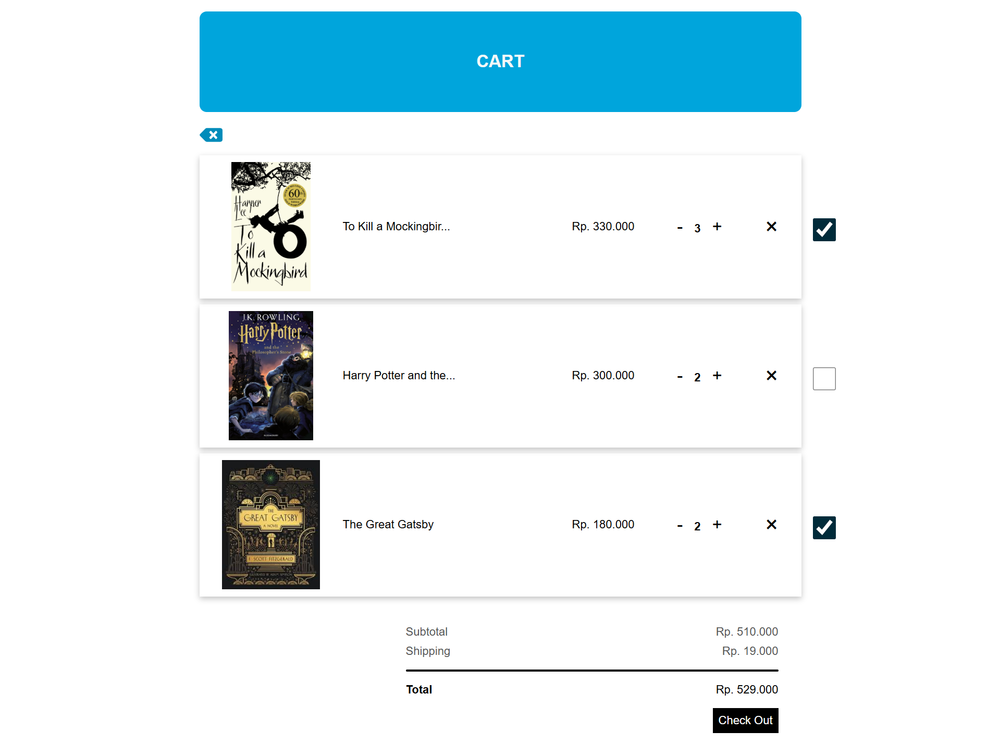

# 📚 Book Store App (React)

A simple **Book Store Web App** built with React.  
This project showcases core frontend skills such as **routing, state management, and UI interaction**.

## ✨ Features

- Fetch and display books from API
- Book detail page with add-to-cart modal
- Shopping cart (increase/decrease qty, delete item, calculate total, check items books)
- Global state with Context API + useReducer
- Custom hook `useAppContext` for clean state access
- Basic CSS styling (no UI framework)
- Loading Screen
- Check Item

## 🛠️ Tech Stack

- React 18 (Hooks & Functional Components)
- React Router v6
- Context API + useReducer
- React Icons
- CSS Modules

## 📌 Roadmap

- [ ] Pagination on book list page
- [ ] Search & filter books

## Pages

- Landing Page
  

- Detail Page
  

- Cart Page
  

- Modal
  
